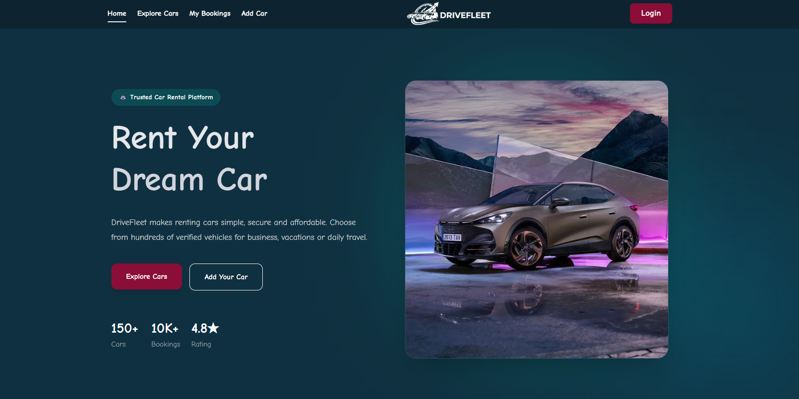
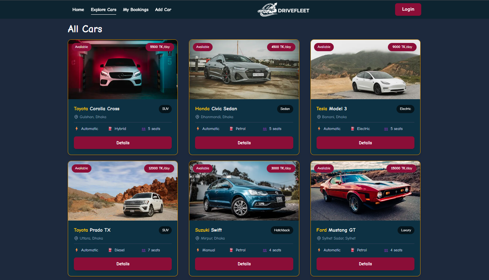
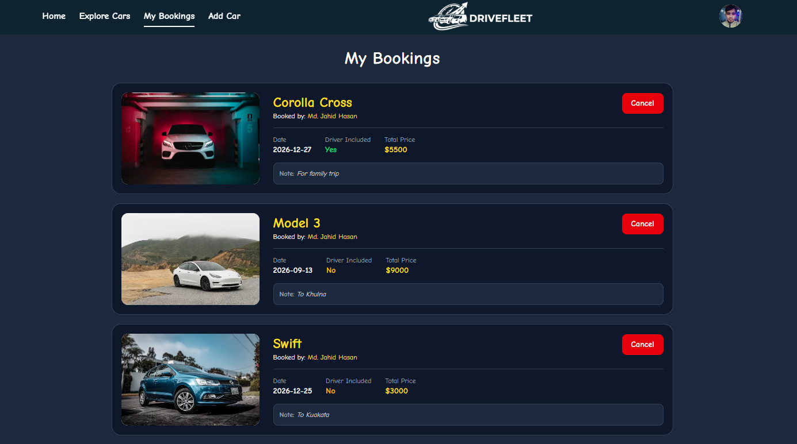

# 🚗 Drive Fleet - Car Rental Platform

A modern, responsive full-stack car rental platform where users can browse available cars, book rentals, manage their bookings, and add their own cars for rent.

> Built with **Next.js**, **Express.js**, **MongoDB**, and **Better Auth**.

---

## 🌐 Live Demo

- **Frontend:** https://drive-fleet-client-gamma.vercel.app/
- **Backend API:** https://drive-fleet-server-one.vercel.app/

---

## 📸 Screenshots

### 🏠 Home Page

---

### 🚘 Available Cars

---

### 📅 Booking Page

---

## ✨ Features

### 🔐 Authentication

- Email & Password Login
- Google Sign In
- User Registration
- Better Auth Authentication
- Protected Routes
- JWT Authentication
- HTTP Only Cookie Security
- Middleware Route Verification

---

### 🚗 Car Management

- Add New Car
- Edit Added Cars
- Delete Added Cars
- Users can manage only their own cars

---

### 📅 Booking System

- Book available cars
- View all personal bookings
- Cancel bookings
- Prevent unauthorized booking actions
- Users can search cars by model or company name
- Users can filter cars by type

---

### 🛡️ Route Protection

#### Public Routes

- Home
- Available Cars
- Login
- Register

#### Protected Routes

- Add Car
- My Bookings
- My Added Cars

---

### ⚙️ Backend Features

- REST API
- CRUD Operations
- Secure Authentication
- JWT Verification
- HTTP Only Cookies
- Express Middleware Protection
- MongoDB Database Integration

---

## 🛠️ Tech Stack

### Frontend

- Next.js
- React
- HeroUI
- Tailwind CSS
- Better Auth

### Backend

- Express.js
- MongoDB
- JWT
- Middleware Authentication

---

## 🔐 Security

- JWT Authentication
- HTTP Only Cookies
- Middleware Authorization
- Protected API Routes
- Secure User Session Handling

---

## 👨‍💻 Author

**Md. Jahid Hasan**

GitHub: https://github.com/wdev-jahidhasan